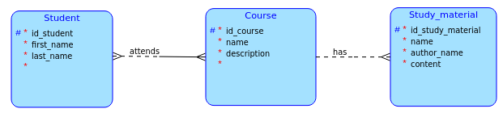

# BI-TJV semestral

## Introduction
Tato aplikace je primitivní systém pro studijní oddělení. Umožňuje spravování studentů (Student), kurzů (Course) a studijních materiálu (Study Material). 

## Conceptual data model


## Usage
Studijní referentka používající tento systém bude mít přehledný nástroj pro přidávání stundetů, kurzů a studijních metriálů. Bude také moct zapisovat studenty do různých kurzů. Kurzům zase bude moct přidat případné studijní materiály.

## Buissness operations
Nad každou tabulkou bude možné použít operace CRUD (create, read, update, delete).

## Advanced functionality
- Aby mohla studijní referentka zapsat studenta do kurzu, musí v tomto kurzu být dostatečná kapacita (occupied musí být menší rovno maxCapacity u daného Course), tohle za ni systém zkontroluje. Pokud bude v daném kurzu dostatečná kapacita, zapsání v pořádku proběhne. Jinak student nebude zapsán. V každém případě však studijní referentka dostane o daném výsledku zprávu. 
- Pokud se pokusí změnit u kurzu maximální kapacitu tak, že by byla menší než je aktuální počet zapsaných, tak ji to systém nedovolí.
- Studijní materiál může být přiřazen pouze k jednomu kurzu, pokud se studijní referentka pokusí jej připsat k jinému kurzu nepovede se to.

## How to run
### Backend
1. Nejdříve je třeba si zprovoznit databázi. V kořenové složce tohoto projektu (pokud není změněn název složky při kolonování z gitu tak tjv-semestral) spusťe příkaz:
```
docker-compose up -d
```
2. V kořenové složce tohoto projektu spusťe příkaz:
```
gradlew bootRun
```
3. Aplikace by měla běžet na portu 8080, pokud není obsazen.
### Frontend
1. V jiném terminálu z kořenové složky přejděte do složky obsahující frontend.
```
cd ./src/main/client/vue-frontend
```
2. Pro instalaci závislostí (bootstrap) spusťte příkaz:
```
yarn install
```
3. Pro spuštění samotného frontendu spusťte příkaz:
```
yarn serve
```
4. Aplikace běží na portu 3000. (V prohlížeči jděte na http://localhost:3000.) Tak je to definované v souboru "package.json" ("serve": "vue-cli-service serve --port 3000"). Pokud chcete port změnit, budete muset port přepsat zde a také ve všech controllerech na backendu, kde je "@CrossOrigin("http://localhost:3000")".

## Documentation
Po spuštění backendu je možnost se podívat na dokumentaci REST API zde: http://localhost:8080/swagger-ui/index.html .